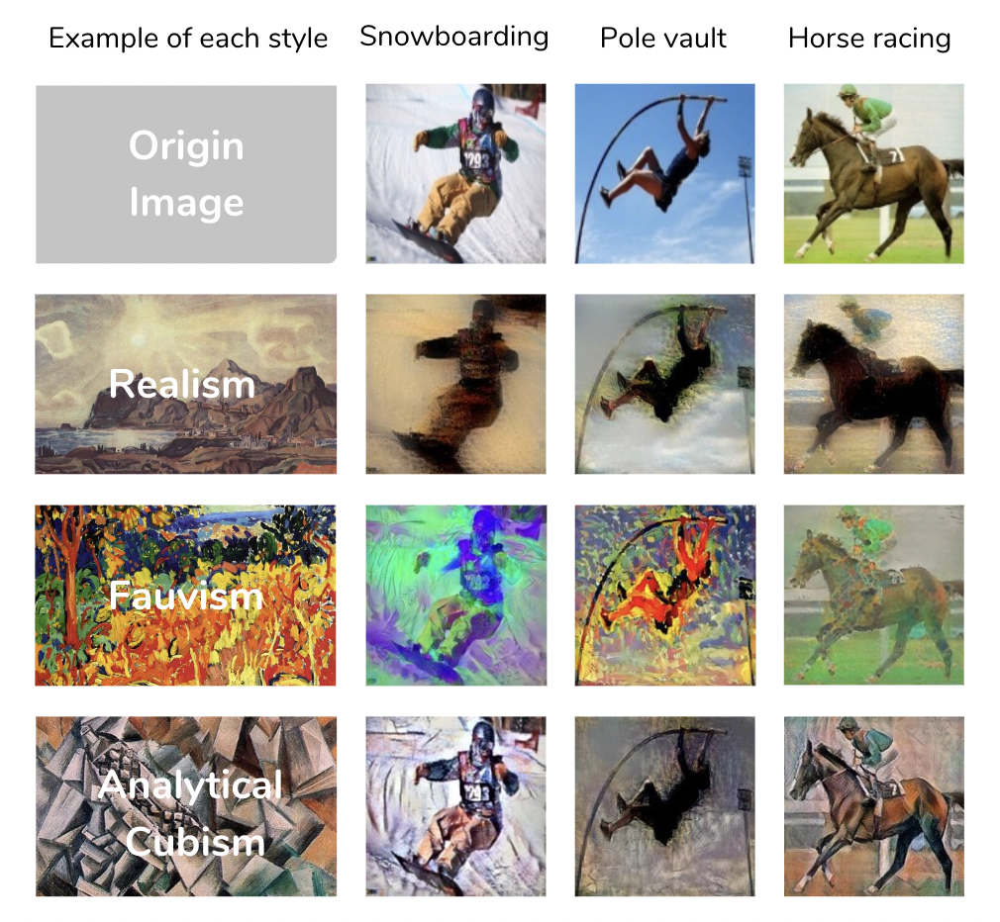

# Stylized Dataset

## Introduction

In order to focus on addressing bias in image datasets, where the background is a common source of bias. For example, classifiers may be induced to rely on background information such as airplanes in the sky, cars on roads, or boats on the water.

By using ["style transfer"](https://github.com/ProGamerGov/neural-style-pt) to create a fake relationship in which the style of the painting correlates with the subject that is to be recognized. the project will intentionally introduce biases into the dataset, providing an opportunity for researchers to develop classifiers that can recognize subjects accurately despite these biases.

## Dataset

The dataset that is generated by combining images from two sources, Meta-Album and WikiArt. 

The Meta-album dataset includes 20 classes of human sports, each class has 40 images. 

The WikiArt dataset includes 40 images of each of the art styles, a total of 20 classes that we manually select from the WikiArt dataset.

The images from these two datasets were randomly paired to create 400 stylized pairs, per pair containing 40 stylized images for example {Snowboarding, Realism} in which the style of the WikiArt image is transferred to the content image from Meta-album. The resulting dataset will be used to challenge researchers to develop classifiers that can accurately recognize subjects despite the intentional biases introduced through this style transfer process.

If you want to create a classification problem, based on how many classes you need you can select from the pair dataset. 

## Download

The stylized dataset can be downloaded at this [URL](https://drive.google.com/file/d/1QibRPtRXkSbt8TQEWLXO3RLEvJNivzUL/view?usp=sharing) (Size = 921.6 MB).

## Description

Each folder contains information on each pair (Style_Object).

In each pair (Style_Object) folder:

images file containing all the stylized images
labels.csv lists the information of stylized images.
The columns of labels.csv are ORIG_CATEGORY_FILENAME, ORIG_STYLE_FILENAME, CATEGORY, STYLE,	and FILENAME.

Note:

    1.The WikiArt dataset can be used only for non-commercial research purpose.
    2.The images in the WikiArt dataset were obtained from WikiArt.org. The authors are neither responsible for the content nor the meaning of these images.
    3.By using the WikiArt dataset, you agree to obey the terms and conditions of WikiArt.org.
